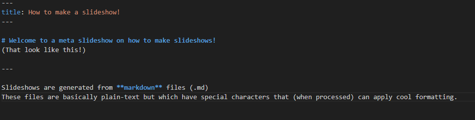
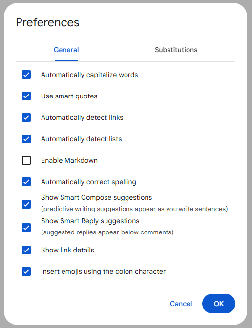
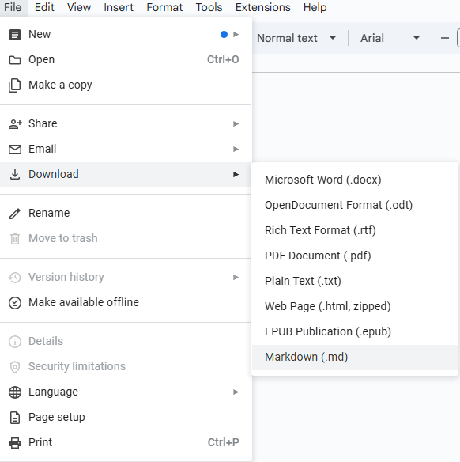
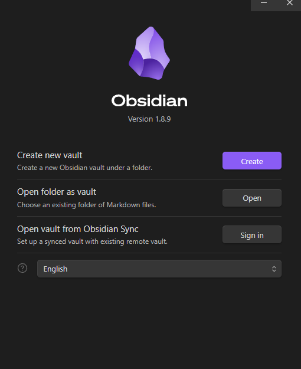

# Welcome to a meta slideshow on how to make slideshows!
(That look like this!)

---

Slideshows are generated from **markdown** files (.md)
These files are basically plain-text but which have special characters that (when processed) can apply cool formatting. 



This is what a markdown file looks like!

Click [here](https://www.markdownguide.org/cheat-sheet/) for a complete Markdown cheatsheet to show how to **bold**, *italicize*, __underline__ and [link]() text!

---

This website uses a javascript package called [reveal.js](https://revealjs.com/) to generate slideshows.

There are handy things this allows markdown to do. <!-- .element: class="fragment" data-fragment-index="1" -->

- Like fragment these pieces of text. <!-- .element: class="fragment" data-fragment-index="2" -->
- And split up sections of markdown into different slides! <!-- .element: class="fragment" data-fragment-index="3" -->
- We can do this by adding 3 dashes ("-\-\-") in our files <!-- .element: class="fragment" data-fragment-index="4" -->

---

reveal.js also allows special presentation of code blocks. Like highlighting specific lines of code

```js [1-2|3|4]
let a = 1;
let b = 2;
let c = x => 1 + 2 + x;
c(3);
```

 Guides on customizing slides and integrating them into markdown files can be found in their <!-- .element: class="fragment" data-fragment-index="1" --> [documentation](https://revealjs.com/markdown/#element-attributes) or simple web searches. 

---

We can also add images and gifs to our slides.

"``"


---

### But why do it like this?

| Pros    | Cons |
| -------- | ------- |
| Easy to share | Harder to write if you're not familiar with markdown  |
| Easy to present |  |
| Easy to read plain text documents  |   |
| Reveal provides tools not given by other slideshow makers |  |
| Web-Friendly!  |   |

---

 ### Writing Markdown
 There are several options for writing markdown files.
 1) Google Docs <!-- .element: class="fragment" data-fragment-index="1" -->
 2) Obsidian <!-- .element: class="fragment" data-fragment-index="2" -->
 3) A code editor like Visual Studio Code <!-- .element: class="fragment" data-fragment-index="3" -->

See their pros and cons in the next few slides <!-- .element: class="fragment" data-fragment-index="4" -->

---

### Google Docs

(I recommend this one!)

| Pros    | Cons |
| -------- | ------- |
| Works from anywhere  | Images and gifs are harder  |
| See formatting in realtime | Code blocks don't work |

---

To use Markdown with Google Docs.

Navigate to **Tools** -> **Preferences** -> Enable Markdown (Under General)



---

To export a .md file from Google Docs.

Navigate to **File** -> **Download** -> "Markdown (.md)"



Make sure to include a copy of all images as files IN A FOLDER WITH the Markdown file.

---

### Obsidian
[Obsidian](https://obsidian.md/) is a text editor (think like Notepad!) but specifically for markdown files.

| Pros    | Cons |
| -------- | ------- |
| See formatting in realtime | Images and gifs are harder  |
| Code blocks work! | MANY FEATURES (which you won't need)     |

---

To use Obsidian, start by creating a "vault" (folder) to hold all your Markdown files



From there it is as easy as starting to write using Markdown syntax. All your text is saved as Markdown files and can be uploaded freely!

---

### Code Editor
Code editors are not necessarily built for markdown but lend themselves easily to this workflow.

| Pros    | Cons |
| -------- | ------- |
| Include images and gifs in the same folder! | Images can't be previewed  |
|  | Can't preview much formatting    |


---

### Guide for making presentations
- Keep each slide brief and concise. Space can be taken up very fast by images/codeblocks/paragraphs

- Keep ALL images in a folder with your .md files (this is so I can upload them to the website well)

- Ask questions and consult documentation!

---

**Now what next?**

1) I recommend reviewing the [markdown cheatsheet](https://www.markdownguide.org/cheat-sheet/),

2) ...then you can view __this__ presentation with annotated comments on [Google Docs here to learn more](https://docs.google.com/document/d/1Py8fu92c6v4GPVarhlI-Iqny7Yb2rc076BknHMBT-xw/edit?usp=sharing) 

3) ...and then just start writing down your lessons!

---

FINISH!

